# OpenAPI to Zod Generation Benchmarks

## Results Summary

| Framework | Mean Time | Min Time | Max Time | Std Dev |
|-----------|-----------|----------|----------|---------|
| skmtc-zod | 1.193s | 1.16s | 1.231s | 0.027s |
| orval-zod | 4.834s | 4.723s | 5.098s | 0.128s |
| kubb-zod | 7.612s | 7.421s | 7.908s | 0.125s |
| openapi-ts-zod | 11.562s | 11.281s | 11.899s | 0.229s |

## Performance Visualization

```mermaid
gantt
    title Generation Time Comparison (seconds)
    dateFormat X
    axisFormat %s
    section Performance
    skmtc-zod (1.19s) :0, 1
    orval-zod (4.83s) :0, 4
    kubb-zod (7.61s) :0, 7
    openapi-ts-zod (11.56s) :0, 11
```

