# OpenAPI to Zod Generation Benchmarks

Performance comparison of popular OpenAPI-to-Zod code generation tools using the **GitHub REST API v3 OpenAPI specification** (11.1MB JSON file).

## 🏆 Key Findings

- **Fastest:** [skmtc](https://github.com/scmtc/skmtc) generates schemas in **0.81s**
- **Speedup:** skmtc is **14.6x faster** than openapi-ts and **6.1x faster** than orval-zod
- **Most Consistent:** skmtc has the lowest standard deviation (0.017s)

<!-- BENCHMARK_RESULTS_START -->

## Results Summary

| Rank | Framework | Mean Time | Min Time | Max Time | Std Dev | Relative Speed |
|------|-----------|-----------|----------|----------|---------|----------------|
| 🥇 #1 | skmtc-zod | 0.811s | 0.79s | 0.841s | 0.017s | **1.0x** (baseline) |
| 🥈 #2 | orval-zod | 4.958s | 4.89s | 5.051s | 0.052s | 6.1x slower |
| 🥉 #3 | kubb-zod | 7.979s | 7.65s | 8.663s | 0.302s | 9.8x slower |
| #4 | openapi-ts-zod | 11.868s | 11.42s | 12.680s | 0.385s | 14.6x slower |

## Performance Visualization

```mermaid
gantt
    title 🚀 Generation Time Comparison
    dateFormat X
    
    section Skmtc
    0.81s :0, 811
    
    section Orval
    4.96s :0, 4958
    
    section Kubb
    7.98s :0, 7979
    
    section openapi-ts
    11.87s :0, 11868
```



### Test Environment

- **Test Specification:** GitHub REST API v3 OpenAPI spec (11.1MB JSON)
- **Iterations:** 10 runs per tool with 1 warmup run
- **Last Updated:** 2025-11-09

<!-- BENCHMARK_RESULTS_END -->

## How to Run

Run the benchmarks yourself:

```bash
./benchmark.sh
```

**Prerequisites:**
- [hyperfine](https://github.com/sharkdp/hyperfine) - Command-line benchmarking tool
- [jq](https://stedolan.github.io/jq/) - JSON processor
- [pnpm](https://pnpm.io/) - Package manager (for Node.js tools)
- [Deno](https://deno.land/) - Runtime (for skmtc)

## About the Tools

| Tool | Description | Links |
|------|-------------|-------|
| **skmtc** | Deno-native OpenAPI code generator with Zod support | [GitHub](https://github.com/scmtc/skmtc) • [JSR](https://jsr.io/@skmtc/cli) |
| **Orval** | OpenAPI client and schema generator | [GitHub](https://github.com/anymaniax/orval) • [Docs](https://orval.dev/) |
| **Kubb** | Plugin-based OpenAPI code generator | [GitHub](https://github.com/kubb-project/kubb) • [Docs](https://kubb.dev/) |
| **openapi-ts** | TypeScript client and schema generator | [GitHub](https://github.com/hey-api/openapi-ts) • [Docs](https://heyapi.vercel.app/) |

All tools generate [Zod v4](https://github.com/colinhacks/zod) schemas from the same OpenAPI specification.
