# OpenAPI to Zod Generation Benchmarks

Performance comparison of popular OpenAPI-to-Zod code generation tools using the **GitHub REST API v3 OpenAPI specification** (11.1MB JSON file).

## 🏆 Key Findings

- **Fastest:** [skmtc](https://github.com/scmtc/skmtc) generates schemas in **1.19s**
- **Speedup:** skmtc is **9.7x faster** than openapi-ts and **4.0x faster** than orval
- **Most Consistent:** skmtc has the lowest standard deviation (0.027s)

<!-- BENCHMARK_RESULTS_START -->

## Results Summary

| Rank | Framework | Mean Time | Min Time | Max Time | Std Dev | Relative Speed |
|------|-----------|-----------|----------|----------|---------|----------------|
| 🥇 #1 | skmtc-zod | 1.193s | 1.16s | 1.231s | 0.027s | **1.0x** (baseline) |
| 🥈 #2 | orval-zod | 4.834s | 4.723s | 5.098s | 0.128s | 4.0x slower |
| 🥉 #3 | kubb-zod | 7.612s | 7.421s | 7.908s | 0.125s | 6.4x slower |
| #4 | openapi-ts-zod | 11.562s | 11.281s | 11.899s | 0.229s | 9.7x slower |

## Performance Visualization

```mermaid
gantt
    title Generation Time Comparison (seconds)
    dateFormat X
    axisFormat %s
    section Performance
    skmtc-zod (1.19s) :0, 1
    orval-zod (4.83s) :0, 4
    kubb-zod (7.61s) :0, 7
    openapi-ts-zod (11.56s) :0, 11
```



### Test Environment

- **Test Specification:** GitHub REST API v3 OpenAPI spec (11.1MB JSON)
- **Iterations:** 10 runs per tool with 1 warmup run
- **Last Updated:** 2025-11-08

<!-- BENCHMARK_RESULTS_END -->

## How to Run

Run the benchmarks yourself:

```bash
./benchmark.sh
```

**Prerequisites:**
- [hyperfine](https://github.com/sharkdp/hyperfine) - Command-line benchmarking tool
- [jq](https://stedolan.github.io/jq/) - JSON processor
- [pnpm](https://pnpm.io/) - Package manager (for Node.js tools)
- [Deno](https://deno.land/) - Runtime (for skmtc)

## About the Tools

| Tool | Description | Links |
|------|-------------|-------|
| **skmtc** | Deno-native OpenAPI code generator with Zod support | [GitHub](https://github.com/scmtc/skmtc) • [JSR](https://jsr.io/@skmtc/cli) |
| **Orval** | OpenAPI client and schema generator | [GitHub](https://github.com/anymaniax/orval) • [Docs](https://orval.dev/) |
| **Kubb** | Plugin-based OpenAPI code generator | [GitHub](https://github.com/kubb-project/kubb) • [Docs](https://kubb.dev/) |
| **openapi-ts** | TypeScript client and schema generator | [GitHub](https://github.com/hey-api/openapi-ts) • [Docs](https://heyapi.vercel.app/) |

All tools generate [Zod v4](https://github.com/colinhacks/zod) schemas from the same OpenAPI specification.
